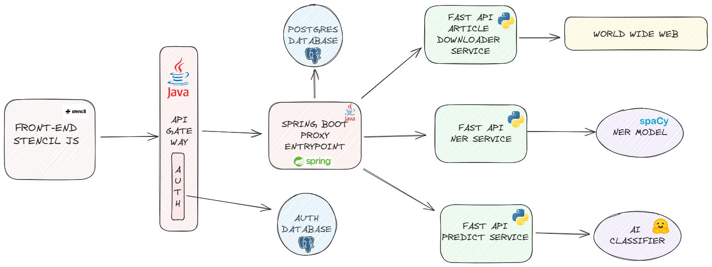

# System for early detection of natural disasters from social networks

AASS FIIT 2024

## Overview

## Description
The system uses deep learning models to filter informative posts from social media, then extracts named entities and if post contains url it downloads the article and includes entities in the final result. Result is saved to PostgreSQL database and exposed on Frontend via API Gateway.

**Frontend**
- [StencilJS SPA application](natdis-detect-fe/README.md)

**Database**
- PostgreSQL for saving predictions
- PostgreSQL for authentication and authorization

### Microservices
- **API Gateway**
    - Entry point for all clients. 
    - Authentication and authorization
- **Proxy Entrypoint**
    - Routing flow of requests to the appropriate microservices
    - Retrieving and saving data to storage
- **Predict Service**
    - Predicts natural disasters from social networks
    - Used for filtering of non informative posts
- **NER Service**:
    - Named Entity Recognition (NER) for posts from social networks
    - Extracts date, location, organization, person, and other entities from the posts
- **Downloader Service**:
    - Downloads data from articles included in the sm posts

### Event-driven architecture
TBA

### Camunda
TBA