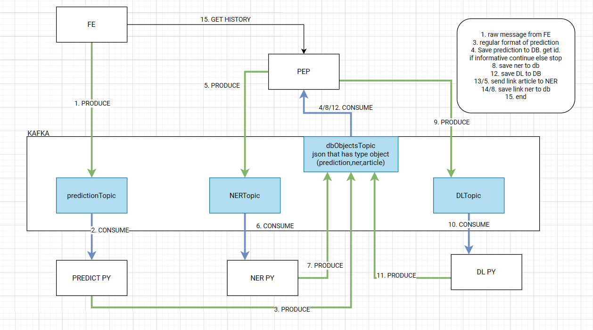

# System for early detection of natural disasters from social networks

AASS FIIT 2024

## Overview


## Setup
Create docker network
```bash
docker network create aass_network
```

### Initial ENV SETUP
```bash
cd micro-services/scripts
cp .env.example .env  # Setup environment variables. e.g. ports as needed
```
> [!IMPORTANT]
> Pay attention to FRONTEND section and KEYCLOAK_AUTH_URL

```dotenv
# DOCKER
COMPOSE_PROJECT_NAME=aass_project

# MICROSERVICES
PREDICT_SERVICE_PORT_EXPOSE=8010
NER_SERVICE_PORT_EXPOSE=8011
DL_SERVICE_PORT_EXPOSE=8012

# FRONTEND
DJANGO_PORT_EXPOSE=8180
# !IMPORTANT!
KEYCLOAK_AUTH_URL=https://<name>.<domain>/auth/realms/<REALM>/protocol/openid-connect/token
KEYCLOAK_CLIENT_ID=<CLIENT_ID>
KEYCLOAK_GRANT_TYPE=<GRANT_TYPE># e.g. password

# ENTRYPOINT API
POSTGRES_DB=aass
POSTGRES_USER=postgres
POSTGRES_PASSWORD=root
POSTGRES_PORT_EXPOSE=5432
ENTRYPOINT_PORT_EXPOSE=8080
```


### FAST API AI Microservices
1. Download the AI model
2. Copy the AI model to the `micro-services/predict_service/data/models` directory. 
It should contain one folder called `naturaldisbert` and this folder has to contain the model files (`model.safetensors`, `config.json`,...)
```bash
mv /path/to/naturaldisbert micro-services/predict_service/data/models
```
This consists of 3 microservices. Build time is based on what is already cached, so estimate atleast 5 - 10 minutes.

Default ports are:
- predict_service: 8010
- ner_service: 8011
- downloader_service: 8012

Docker image size:
- predict_service: 2.03 GB
- ner_service: 2.59 GB
- downloader_service: 1.13 GB

Each service has endpoints exposed on http://{HOST}:{PORT}/docs
where HOST is the IP of the machine running the docker container and PORT is the port of the service. For local setup it is `http://localhost:{PORT}/docs` e.g. `http://localhost:8010/docs`

### Frontend
Django FE connects authenticates with Keycloak and uses the API Gateway to access the microservices.

### Entry Point API Gateway Service
Spring Boot application, accesses microservices and database.

### Start
```bash
cd micro-services/scripts
docker compose up -d
```
Access the frontend on `http://localhost:8180`

#### Frontend Standalone - Optional
See [Frontend README](natdis-detect-fe/README.md)

#### Entry Point Standalone - Optional
See [Entry Point README](micro-services/proxy_entrypoint_service/README.md)

## Description
The system uses deep learning models to filter informative posts from social media, then extracts named entities and if post contains url it downloads the article and includes entities in the final result. Result is saved to PostgreSQL database and exposed on Frontend via API Gateway.

**Frontend**
- Django Fullstack

**Database**
- PostgreSQL for saving predictions
- PostgreSQL for authentication and authorization

### Microservices
- **API Gateway**
    - Entry point for all clients. 
    - Authentication and authorization
- **Proxy Entrypoint**
    - Routing flow of requests to the appropriate microservices
    - Retrieving and saving data to storage
- **Predict Service**
    - Predicts natural disasters from social networks
    - Used for filtering of non informative posts
- **NER Service**:
    - Named Entity Recognition (NER) for posts from social networks
    - Extracts date, location, organization, person, and other entities from the posts
- **Downloader Service**:
    - Downloads data from articles included in the sm posts

### Event-driven architecture
- Kafka
- 4 topics
- Automatically created
- Architecture:


### Camunda BPMN
- Camunda v7
- Install https://camunda.com/download/modeler/ Camunda modeler
- Open all processes in the modeler
- Start all services
- Deploy processes on URI http://localhost:8081/engine-rest
- Make prediction and observe in the cockpit
- Optionally rate the prediction
