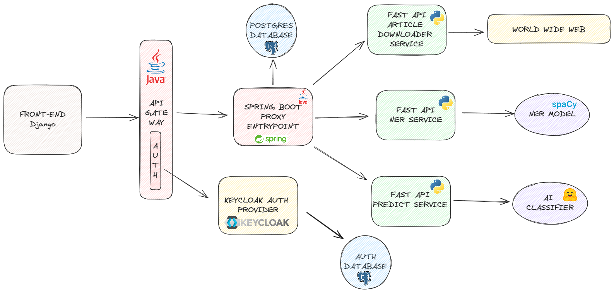

# System for early detection of natural disasters from social networks

AASS FIIT 2024

## Overview


## Setup
Create docker network
```bash
docker network create aass_network
```

### FAST API Microservices
1. Download the AI model
2. Copy the AI model to the `micro-services/predict_service/data/models` directory. 
It should contain one folder called `naturaldisbert` and this folder has to contain the model files (`model.safetensors`, `config.json`,...)
```bash
mv /path/to/naturaldisbert micro-services/predict_service/data/models
cd micro-services/scripts
cp .env.example .env  # Setup environment variables. e.g. ports as needed
docker compose -f fastapi-docker-compose.yaml up -d
```
This will create 3 microservices under one docker compose. They are already connected to the external`aass_network` network. Build time is based on what is already cached, so estimate atleast 5 - 10 minutes.

Default ports are:
- predict_service: 8010
- ner_service: 8011
- downloader_service: 8012

Docker image size:
- predict_service: 2.03 GB
- ner_service: 2.59 GB
- downloader_service: 1.13 GB

Each service has endpoints exposed on http://{HOST}:{PORT}/docs
where HOST is the IP of the machine running the docker container and PORT is the port of the service. For local setup it is `http://localhost:{PORT}/docs` e.g. `http://localhost:8010/docs`

## Description
The system uses deep learning models to filter informative posts from social media, then extracts named entities and if post contains url it downloads the article and includes entities in the final result. Result is saved to PostgreSQL database and exposed on Frontend via API Gateway.

**Frontend**
- [TBA FE APP](natdis-detect-fe/README.md)

**Database**
- PostgreSQL for saving predictions
- PostgreSQL for authentication and authorization

### Microservices
- **API Gateway**
    - Entry point for all clients. 
    - Authentication and authorization
- **Proxy Entrypoint**
    - Routing flow of requests to the appropriate microservices
    - Retrieving and saving data to storage
- **Predict Service**
    - Predicts natural disasters from social networks
    - Used for filtering of non informative posts
- **NER Service**:
    - Named Entity Recognition (NER) for posts from social networks
    - Extracts date, location, organization, person, and other entities from the posts
- **Downloader Service**:
    - Downloads data from articles included in the sm posts

### Event-driven architecture
TBA

### Camunda
TBA
